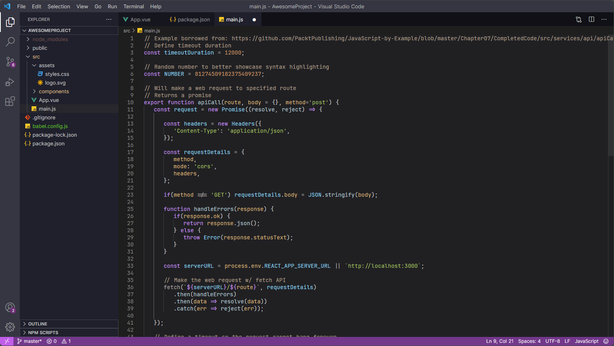
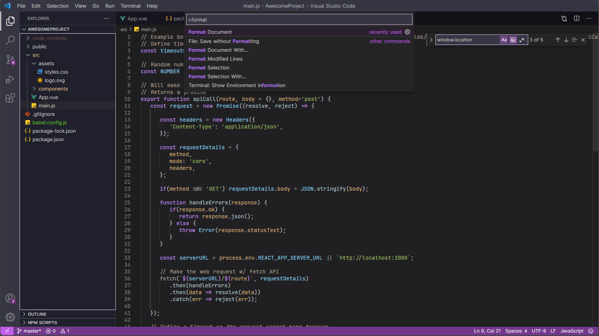
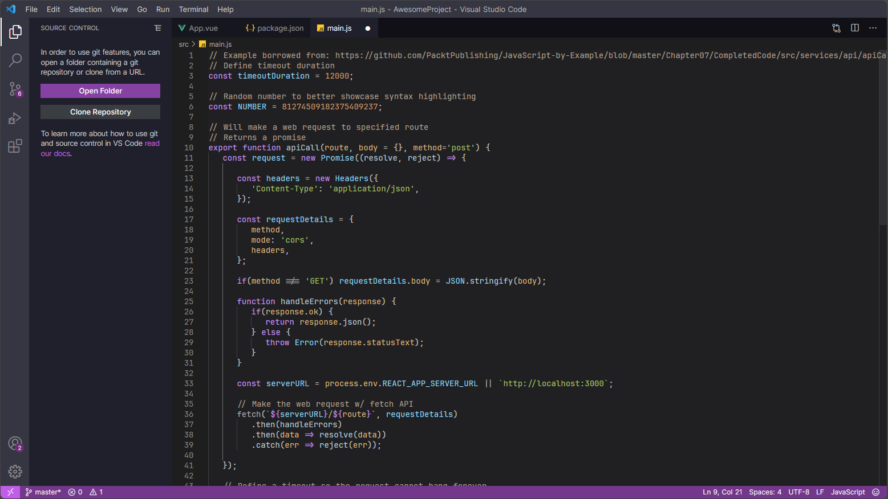
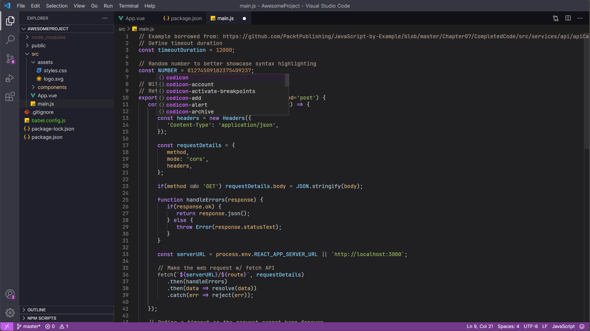
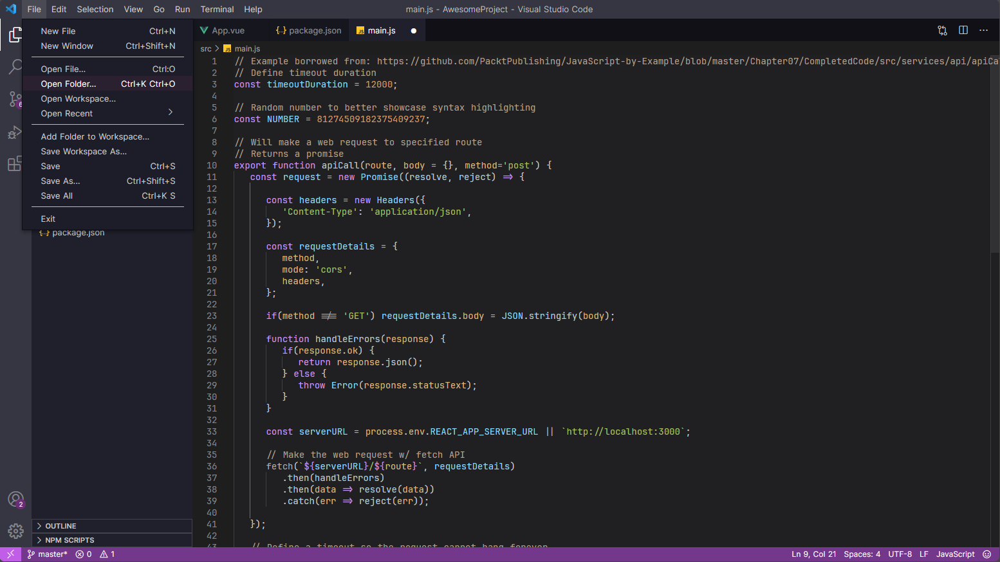
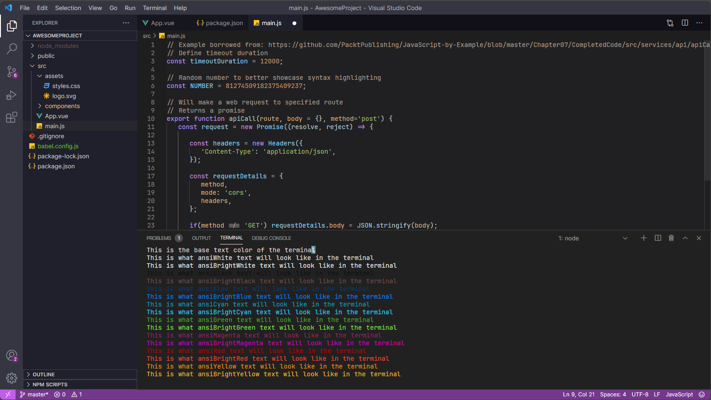
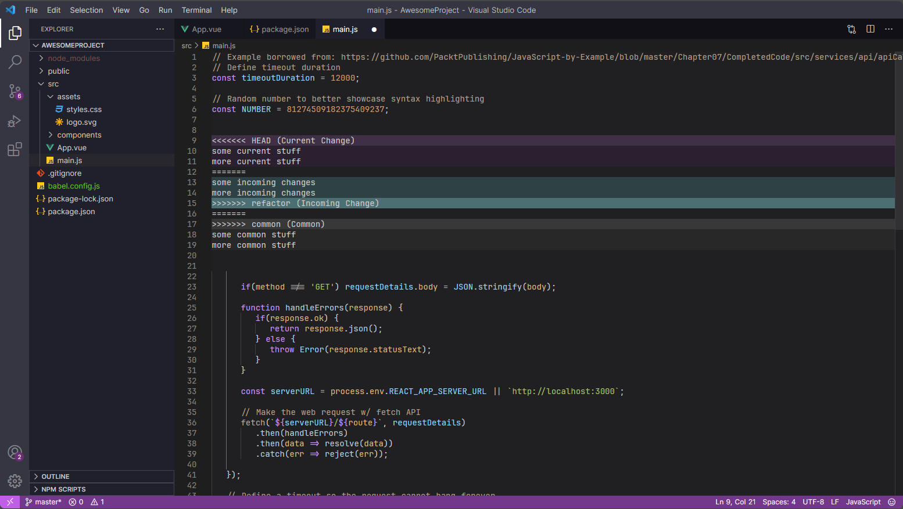
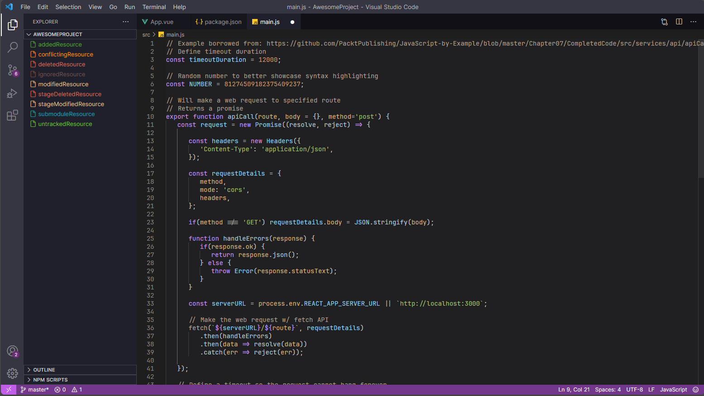
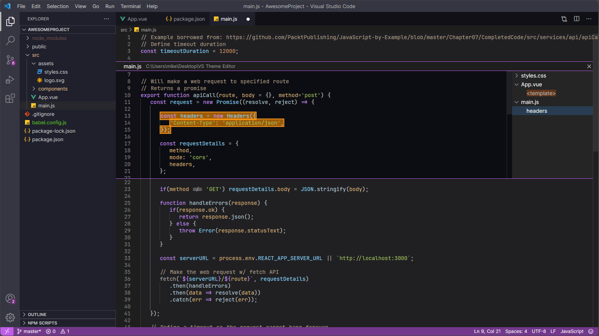
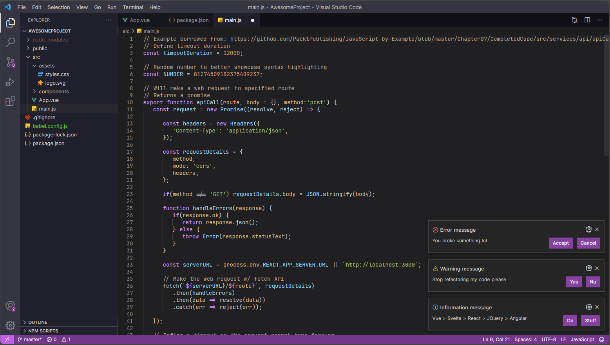

# VSCode Theme – Shadowborn
Personal theme for Visual Studio Code with a *Solo Leveling* theme, named after the Season 2 insert song [*Shadowborn*](https://www.youtube.com/watch?v=N6xMg5CzJLI).

Based on Dark Modern (heavily modified). Inspired to some extent by Darcula and Railgun.

Created with the help of [VSCode Theme Studio](https://themes.vscode.one/). Click [here](https://themes.vscode.one/theme/RyzenFromFire/94UnXr35) to view the theme on that site.

## Screenshots

